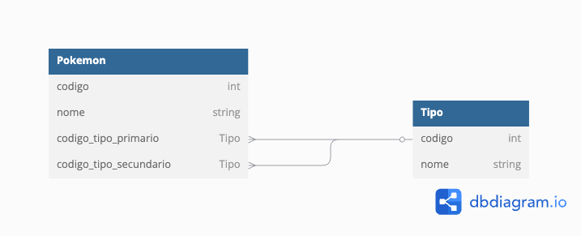

# Desafio Elevential

O desafio abaixo serve para avaliar os conhecimentos de frontend e backend do participante.

## Escopo
O seu cliente, Carvalho, é um catalogador de Pokemon. Ele precisa de um sistema para deixar mais fácil o cadastro de novas espécias que ele vem encontrando em suas pesquisas, de forma simples e rápida, através de um sistema web.
Carvalho já tem uma lista com 150 desses Pokemons, e o sistema deve vir com esses Pokemons pré-cadastrados.
[Esses dados podem ser encontrados aqui](./dados_iniciais.json)

Cada Pokemon terá as seguintes informações:
1. Código
2. Nome
3. Tipo
4. Tipo secundário
   1. Campo opcional

Cada tipo terá as seguintes informações:
1. Código
2. Nome


## Requisitos
1. Forma de cadastrar, listar, editar e deletar Pokemons, conforme a descrição do que precisa ser salvo em um Pokemon
2. Forma de cadastrar, listar, editar e deletar tipos
3. Criação dos Pokemons que Carvalho tem, dispnibilizaro [aqui](./dados_iniciais.json)
4. Listagem com filtros de nome e tipo
5. Repositório no github com o código
6. Descrição no readme do repositório, ensinando como rodar na máquina localmente o seu sistema

Caso não seja possível finalizar tudo, você pode enviar o que conseguiu finalizar!

## Opcionais
1. Video mostrando o uso do sistema no Youtube, no readme do repositório
2. Hospedagem na internet
3. Containerização do sistema

## Tecnologia Utilizada

Utilizei as tecnologias abaixo:

1. Python -> Django
2. sqlite

## Esboço do Banco de Dados


## Passo a passo para rodar o projeto

1. Clonar repositório
```
git clone https://github.com/l1wba/desafio-elevential.git
```
2. Instalar dependências
```
pip install -r requirements.txt
```
3. Realizar migração do banco
```
python manage.py migrate
```
4. Povoar table de tipos
```
python manage.py loaddata pokedex\fixtures\dados_iniciais_tipos.json
```
5. Povoar table de pokemons
```
python manage.py loaddata pokedex\fixtures\dados_iniciais_pokemons.json
```
6. Iniciar server
```
python manage.py runserver
```

## Link para vídeo do sistema em uso

https://youtu.be/HBSKeRSSGRs